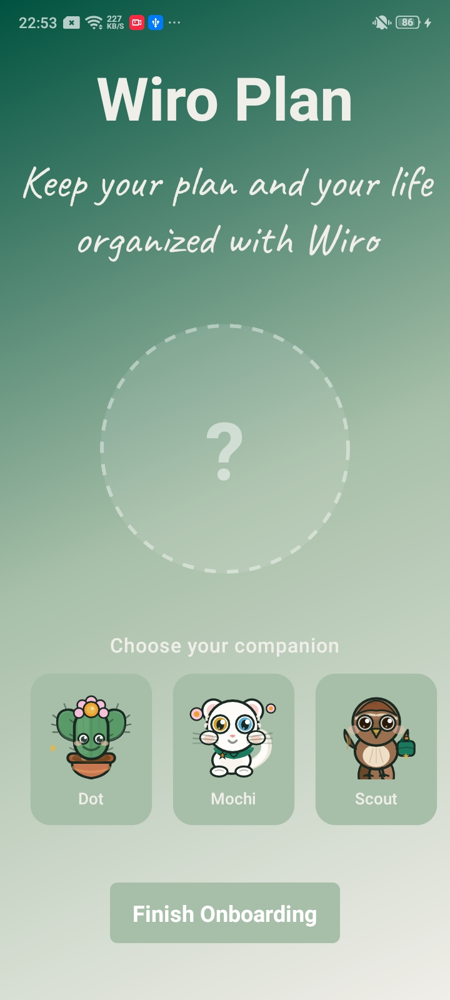
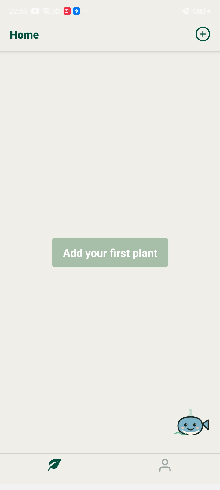
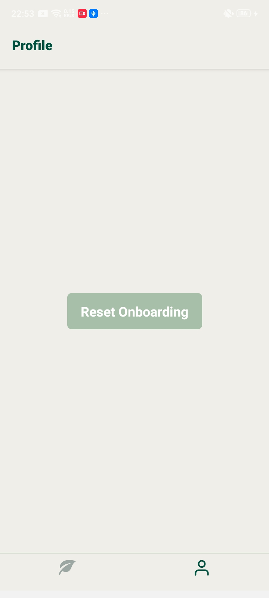
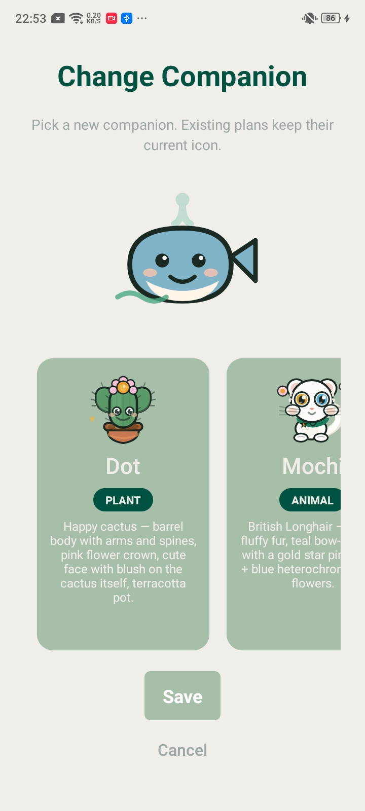
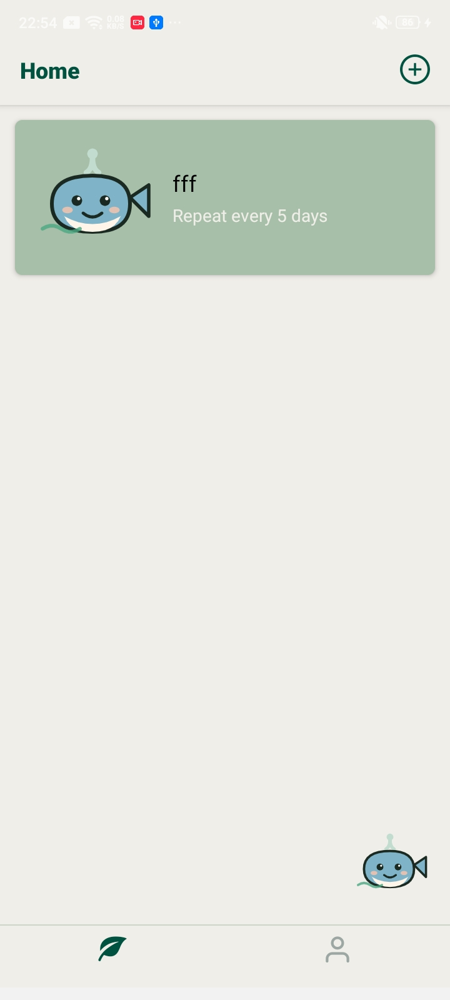
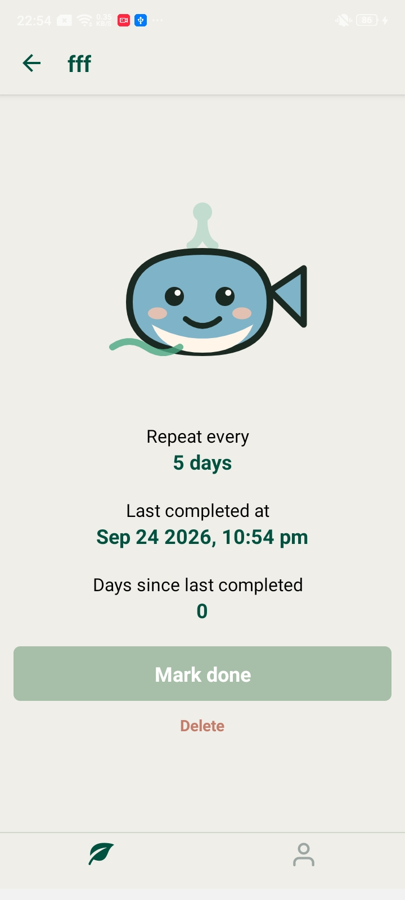

<div align="center" style="padding: 24px 0 10px;">
  
  <h1 style="margin: 12px 0 8px; color: #ffffff; font-size: 36px; font-weight: 700;">Plantly</h1>
</div>

<p align="center" style="margin-top: 0; color: #d1d5db; font-size: 16px;">
  Plant care companion for your daily routine
</p>

<p align="center">
  
  
  
  
</p>

Plantly là một ứng dụng chăm sóc cây theo chu kỳ, giúp người dùng tạo kế hoạch, theo dõi nhắc nhở chăm sóc và giữ kết nối với từng cây của mình theo cách dễ thương, dễ nhìn và rất cá nhân.

Từ onboarding, chọn companion, tạo kế hoạch cho cây, tới việc ghi nhận lần hoàn thành gần nhất, mọi bước trong app đều được thiết kế để mang lại cảm giác thư giãn, rõ ràng và gần gũi như một người bạn đồng hành thực sự.

## Tại sao app này lại khác?

- Mỗi cây có thể có một kế hoạch chăm sóc riêng với chu kỳ lặp lại khác nhau.
- Người dùng có thể chọn companion để có trải nghiệm gần gũi, sinh động và dễ thương hơn.
- Giao diện được thiết kế rõ ràng, mịn màng, phù hợp với ứng dụng nuôi dưỡng thói quen mỗi ngày.
- Dữ liệu được lưu cục bộ trên thiết bị, nên app vẫn hoạt động ngay cả khi không cần backend.
- Ảnh cây và companion được lưu và hiển thị trực tiếp trong trải nghiệm người dùng.

## Demo

<p align="center">
  
  
  
</p>

<p align="center">
  
  
  
</p>


## Stack công nghệ đang dùng

### Frontend / app framework
- React Native `19.1.0`
- Expo `~54.0.36`
- Expo Router `~6.0.24`
- TypeScript `~5.9.3`

### Navigation và UX
- Expo Router cho routing và stack navigation
- `react-native-safe-area-context` để xử lý safe area
- `react-native-screens` để tối ưu màn hình native
- `react-native-keyboard-aware-scroll-view` để hỗ trợ nhập liệu trên màn hình tạo kế hoạch

### State management và persistence
- Zustand `^5.0.14`
- `@react-native-async-storage/async-storage` cho lưu trữ local
- `zustand/middleware` với `persist` để lưu trạng thái onboarding và danh sách cây

### Images và media
- `expo-image` cho hiển thị hình ảnh
- `expo-image-picker` cho phép chọn ảnh từ thư viện thiết bị
- `expo-file-system` để copy ảnh vào thư mục document của app trước khi lưu URI
- `expo-linear-gradient` cho nền gradient đẹp mắt

### Date / utilities
- `date-fns` để xử lý ngày tháng, ví dụ tính số ngày kể từ lần hoàn thành cuối
- `@expo/vector-icons` và hệ thống icon riêng của project
- `expo-haptics` cho phản hồi cảm giác khi tương tác

### Styling và design
- Theme tập trung trong `theme.ts`
- Custom components như `PlantlyButton`, `PlanCard`, `PlantlyImage`
- UI được xây dựng theo hướng mobile app dễ đọc, dễ nhìn, phù hợp với trải nghiệm chăm sóc cây

### Tooling
- pnpm workspace
- ESLint + Expo lint
- Prettier
- Native Android project trong `android/`

## Tính năng chính

- Onboarding với lựa chọn companion ban đầu.
- Tạo kế hoạch chăm sóc với tên, chu kỳ lặp lại theo số ngày và ảnh tùy chọn.
- Chọn ảnh từ thư viện trên thiết bị Android/iOS.
- Ghi nhận thời điểm hoàn thành bằng nút "Mark done".
- Xem chi tiết kế hoạch:
  - tên cây
  - tần suất chăm sóc
  - ngày hoàn thành gần nhất
  - số ngày tính từ lần hoàn thành cuối
- Xóa kế hoạch cây.
- Thay đổi companion mà không phá vỡ companion hiện có trong từng kế hoạch.
- Sử dụng bubble menu ở góc màn hình để truy cập nhanh các hành động.
- Lưu dữ liệu local để app luôn duy trì trạng thái nhất quán khi mở lại.

## Yêu cầu môi trường

- Node.js phiên bản LTS
- pnpm
- Android: Android Studio + Android SDK + emulator hoặc thiết bị thật
- iOS: macOS + Xcode + simulator hoặc thiết bị thật

Kiểm tra pnpm:

```bash
pnpm --version
```

## Cài đặt

```bash
pnpm install
```

## Chạy dự án

Khởi động Expo dev server:

```bash
pnpm start
```

Sau đó chọn nền tảng trong terminal hoặc quét QR code bằng Expo Go.

### Android

```bash
pnpm android
```

### iOS

```bash
pnpm ios
```

> Lệnh iOS cần macOS và Xcode.

### Web

```bash
pnpm web
```

> Chức năng chọn ảnh từ thư viện không hỗ trợ trên web. Để dùng tính năng này, hãy chạy trên mobile (Android/iOS).

## Kiểm tra chất lượng mã nguồn

```bash
pnpm lint
```

## Cấu trúc thư mục chính

```text
app/                              # Routes và màn hình Expo Router
  _layout.tsx                     # Layout gốc + cấu hình modal screens
  onboarding.tsx                  # Màn hình onboarding chọn companion
  new.tsx                         # Tạo kế hoạch mới
  change-companion.tsx            # Đổi companion
  (tabs)/
    _layout.tsx                   # Layout tab navigator
    profile.tsx                   # Reset onboarding
    (home)/
      _layout.tsx                 # Layout của home tab
      index.tsx                   # Danh sách cây / bubble menu
      plants/[plantId].tsx         # Chi tiết cây và hành động xóa / mark done

components/                      # Component dùng chung
  PlanCard.tsx                    # Card hiển thị kế hoạch cây
  PlantlyButton.tsx               # Nút button chung
  PlantlyImage.tsx                # Wrapper xử lý ảnh mặc định / ảnh đã lưu

store/                           # Zustand stores
  planStore.ts                    # Quản lý danh sách kế hoạch
  userStore.ts                    # Quản lý onboarding + companion

utils/                           # Helper và UI utilities
  icon.tsx                        # List companion icon và metadata
  bubbleMenu.tsx                  # Menu tương tác ở góc màn hình

assets/                          # Hình ảnh, icon, splash, demo screenshots

theme.ts                         # Theme màu sắc chung
app.json                         # Expo app config
eas.json                        # EAS config
android/                         # Native Android project
```

## Luồng dữ liệu và lưu trữ

- `userStore.ts` lưu trạng thái onboarding và companion của người dùng.
- `planStore.ts` lưu danh sách kế hoạch và timestamp lần hoàn thành gần nhất.
- Dữ liệu được lưu bởi Zustand `persist` cùng với `AsyncStorage`.
- Khi người dùng chọn ảnh từ thư viện, ảnh sẽ được copy vào thư mục document của ứng dụng trước khi URI được lưu vào plan.
- Khi xoá app hoặc xóa dữ liệu ứng dụng, các dữ liệu cục bộ sẽ bị xóa theo cách hoạt động của AsyncStorage.

## Workflow người dùng cơ bản

1. Người dùng trải qua onboarding và chọn companion.
2. Tạo kế hoạch cho cây với tên và tần suất chăm sóc.
3. Thêm ảnh nếu muốn.
4. Ở màn hình home, app hiển thị danh sách cây.
5. Mỗi plan có thể được đánh dấu hoàn thành để cập nhật thời gian gần nhất.
6. Khi cần, người dùng có thể xóa kế hoạch hoặc đổi companion.

## Build với EAS

Dự án đã có cấu hình EAS trong `eas.json`. Nếu muốn build trên cloud:

```bash
pnpm add --global eas-cli
eas login
eas build:configure
```

Sau đó chọn profile phù hợp trong `eas.json` để tạo build Android hoặc iOS.

## License

Xem file [LICENSE](LICENSE) để biết thông tin giấy phép của dự án.
